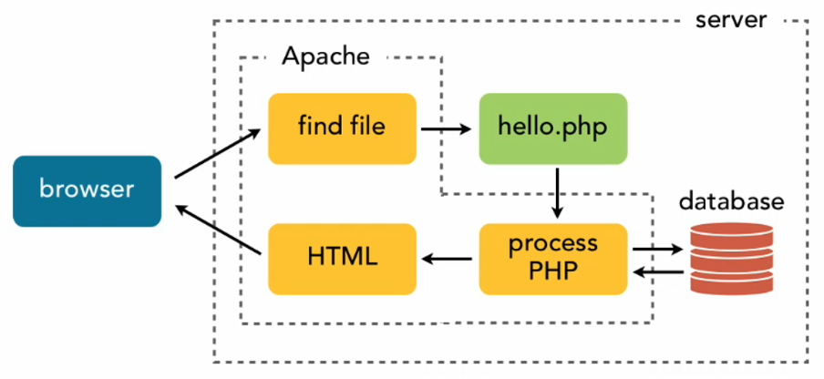

# Week 1

## PHP
We gaan tijdens dit vak werken aan dynamische websites. Elke bezoeker van je website wil je als een soort klant gaan zien. Elke bezoeker is een gebruiker van je site. Met HTML kon een gebruiker alleen je site bekijken en doorheen klikken. 
Met PHP ga je informatie van een gebruiker opslaan, je laat gebruikers inloggen en uitloggen, registeren en eventueel zaken aanmaken zoals producten, gerechten of andere dingen. We gaan controles uitvoeren wie er is ingelogd en wie niet. Sommige pagina’s ga je afschermen en je gaat data uit een database halen. 
TL;DR; Je gaat dynamische websites maken met PHP en SQL.

## SQL
SQL is een database taal waarmee je data kunt opslaan, verwijderen, bekijken en updaten. Ook ga je databases en tabellen en kolommen maken.

## PHP VS. HTML (CSS)
Je bent waarschijnlijk gewend om een HTML-pagina (index.html) te coderen en deze met een dubbele klik van je muis te openen in je browser. Lekker makkelijk. 
Met PHP kan dit niet. PHP is een backend taal en om de code hiervan ‘te runnen’ (parsen) heb je een server nodig. Deze server serveert de pagina’s naar de browser toe op het moment dat het nodig is.

## URL
Als je in je browser een adres intypt in de adresbalk dan vraag je aan een server een pagina op, bestaat de pagina dan wordt de gevraagde pagina getoond:
 
Vergelijk het eens met een ober in een restaurant: Je vraag om een ice tea. De ober geeft aan dat ze dat verkopen en serveert de ice tea aan je uit. 

## WEBSERVER
Dit is hetzelfde met een webpagina. Je vraagt een specifieke site of pagina (via de adresbalk) en de webserver serveert de pagina. Als de pagina niet bestaat dan krijg je een 404 error.
Alle sites van het world wide web draaien op servers van hostingsproviders. Omdat jij tijdens je opleiding gaat oefenen met websites bouwen heb je ook een webserver nodig. Je hebt geen echte hostingsprovider nodig. Echter kun je dit heel gemakkelijk nabootsen.

## REQUEST RESPONSE CYCLE
De request response cycle is de cyclus waarin een webpagina wordt gemaakt.

1. De gebruiker vraagt een pagina op.
2. De webserver ontvangt de vraag.
3. De webserver verwerkt de vraag.
4. De webserver geeft de pagina terug aan de gebruiker.

(Deze cyclus is ook te zien in de browser via de Developer Tools)
En op deze afbeelding zie je hoe de request response cycle werkt:



Wij gaan deze cyclus ook gebruiken om de website te maken.
Wij gaan een lokale webserver gebruiken. Deze is al aangemaakt in de docker-compose.yml file.

## EEN PROJECTEN MAP

### OPDRACHT 1: MAAK EEN PROJECTEN MAP
1.	Maak via Explorer (verkenner) een map aan voor ALLE projecten. Bijvoorbeeld op deze plek:
This PC > Projecten (C:\Projecten)

> Maak geen projecten op ONEDRIVE!! 
(git en onedrive zijn geen vrienden)

### OPDRACHT 2: FORK EEN REPO
Je gaat aan verschillende projecten werken. Wij gaan elk project een eigen webserver geven, inclusief databaseserver. De code hiervoor staat op GitHub. 
Op Github staat een repository die je moet forken naar je eigen account.

2.	Login in bij Github.com
3.	Ga naar: https://github.com/NOVA-college-Haarlem/mijn-eerste-project
4.	Klik op FORK (rechtsboven)
5.	Klik op Create Fork
6.	Ga nu naar je eigen Github Account. De repository staat nu bij je eigen repositories.
7.	Open de repo onder je eigen account

### OPDRACHT 3: KLOON PROJECT

Hiervoor heb je het project geforkt naar je Github account. Nu gaan het project naar je laptop/computer brengen door te klonen:
1.	Kloon de repo die onder jouw eigen Github account staat nu naar je eigen computer
    - Klik op de groene CODE knop 
    - Klik op de kopieer knop
2.	Open VS code
    - Open de projecten map in VS code (of in de terminal)
    - Klik op “Yes, I trust the authors”
3.	Je gaat nu je GitHub Repository klonen via de terminal
4.	Open de terminal:
    - In de terminal kun je commando’s opgeven. 
    - Type het volgende in:
    git clone https://github.com/<jouw github username>/mijn-eerste-project 
 
9.	Druk op Enter
10.	Nu wordt het project van je remote repo gekloond naar je local repo in de projecten map
11.	Je hebt nu de bestanden (en de geschiedenis) van het project op je eigen machine staan:
 
### Opdracht 4: OPEN PROJECT IN VS CODE
1.	Open VS code
2.	Open het project 'mijn-eerste-project' in VS code
3. Je ziet nu de bestanden van het project in VS code
4. Open een terminal in VS code
5. Typ in de terminal:
    ```bash
    docker compose up -d
    ```
6. Open je browser en ga naar http://localhost
7. Je ziet nu de website van het project in je browser


### OPDRACHT 5: INDEX.PHP AANPASSEN
1. Je ziet index.html staan. Dit is een HTML pagina. Aangezien we gaan werken met dynamische websites moeten we deze aanpassen naar een PHP pagina.
2. We veranderen de extensie van de index.html naar index.php
3. Open de index.php in VS code
4. We passen de titel van de pagina aan: "Welkom bij mijn Pokémon Verzameling" wordt nu "Mijn Pokémon Verzameling"
5. Sla de index.php op
6. Open je browser en ga naar http://localhost
7. Je ziet nu de vernieuwde website van het project in je browser

### OPDRACHT 6: PAGINAS LINKEN
1. Via het menu kun je nu naar de pagina's gaan.
2. We gaan nu de pagina's linken aan elkaar.
3. Open de index.php in VS code
4. We voegen een link toe aan de pagina's:
    - <a href="about.php">Over mij</a>
    - <a href="contact.php">Contact</a>
5. Sla de index.php op
6. Test je code in de browser

### OPDRACHT 7: DRY PRINCIPLE
1. We gaan nu de code opruimen.
2. De navigatie op alle pagina's is hetzelfde. 
3. Maak een nieuwe pagina: "header.php"
4. Open de header.php in VS code
5. We voegen de navigatie uit de index.php toe aan de header.php
6. We verwijderen de navigatie uit de index.php
7. Nu moeten we de header.php in elke pagina toevoegen Door PHP te gebruiken: `include 'header.php';`
8. Test je code in de browser
9. Nu doen we hetzelfde op de andere twee pagina's: "about.php" en "contact.php"
10. Test je code in de browser

### OPDRACHT 8: DYNAMISCH MENU
1. We gaan nu het menu dynamisch maken.
2. Open de header.php in VS code
3. We gaan het menu dynamisch maken door gebruik te maken van een array.


We zouden een array zo kunnen maken:
```php
<?php

$menuItems = ['index.php', 'about.php', 'contact.php'];
?>
```
Wat zien we hier? Een variabele genaamd $menuItems, een array die een paar items bevat. Als we bij deze array een waarde willen 'uitlezen' dan kunnen we dat zo doen:

```php
<?php
echo $menuItems[0]; // De eerste waarde van de array
```

Wij gaan echter een associatie array gebruiken:

```php
$menuItems = [
    'home' => 'index.php',
    'about' => 'about.php',
    'contact' => 'contact.php'
];
```

Omdat we een associatie array gebruiken kunnen we het 'uitlezen' zo doen:

```php
echo $menuItems['home']; // De waarde van de key 'home'
echo $menuItems['about']; // De waarde van de key 'about'
echo $menuItems['contact']; // De waarde van de key 'contact'
```

We kunnen ook loopjes maken om de array te doorlopen:

```php
foreach($menuItems as $key => $value) {
    echo $key . ' - ' . $value;
}
```

En als we dat in ons project toepassen ziet dat er dan zo uit:
```php
<?php

$menuItems = [
    'home' => 'index.php',
    'about' => 'about.php',
    'contact' => 'contact.php'
];

foreach($menuItems as $key => $value) {
    echo '<a href="' . $value . '">' . $key . '</a>';
}
?>
```
Deze schrijfwijze is ook anders te schrijven:
```php
<?php
$menuItems = [
    'home' => 'index.php',
    'about' => 'about.php',
    'contact' => 'contact.php'
];
?>
<?php foreach($menuItems as $key => $value):?>
    <a href="<?php echo $value; ?>">
        <?php echo $key; ?>
    </a>
<?php endforeach; ?>
?>
```
Deze laatste schrijfwijze is de meest gebruikte en is ook de meest leesbare.

Als we nu nog een pagina willen toevoegen en dus het menu willen uitbreiden dan hoeven we alleen maar de array aan te passen en de pagina toe te voegen.

Bijvoorbeeld:
```php
$menuItems = [
    'home' => 'index.php',
    'about' => 'about.php',
    'contact' => 'contact.php',
    'nieuwe pagina' => 'nieuwe-pagina.php'
];
```

### OPDRACHT 9: POKEMON FROM DB

1. We gaan nu de pokemon uit de database halen.
2. Daarvoor hebben we een database nodig.
3. Deze is al aangemaakt via Docker genaamd 'pokemon_db'.
4. We gaan data in de database opslaan door middel van het bestand `pokemon-cards.sql`.
5. We gaan nu de data uit de database halen. En om de oefen met het tonen hiervan maken we een nieuwe pagina: `pokemon-cards.php`.
6. Maak een nieuwe pagina: `pokemon-cards.php`
7. Open de pagina in VS code
8. Neem de volgende code over:
```php
<?php

$dbhost = 'localhost';
$dbname = 'pokemon_db';
$dbuser = 'root';
$dbpass = '';

$conn = mysqli_connect($dbhost, $dbuser, $dbpass, $dbname);

// Check connection
if (!$conn) {
    die("Connection failed: " . mysqli_connect_error());
}

$sql = "SELECT * FROM pokemon"; // SQL query om alle pokemon uit de database te halen
$result = mysqli_query($conn, $sql);

$pokemon_cards = mysqli_fetch_all($result, MYSQLI_ASSOC);

// Loop door alle pokemon uit de database
foreach($pokemon_cards as $pokemon_card) {
    echo '<div class="pokemon-card">';
    echo '<h2>' . $pokemon_card['name'] . '</h2>';
    echo '<p>' . $pokemon_card['type'] . '</p>';
    echo '';
    echo '</div>';
}

?>
```

