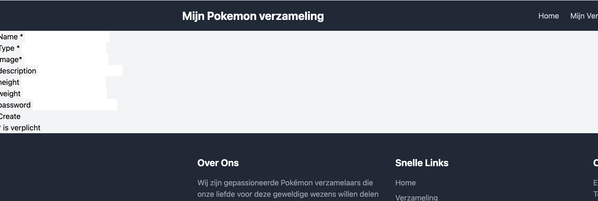

# Blok 4

## Week 4

### Les 1 - Sessions

In deze les gaan we een session starten. Een session is een manier om data tussen de server en de client te bewaren. Dit is handig voor het inloggen van gebruikers.

#### Opdracht 1

We schermen de pagina `dashboard.php` af. Dit kunnen we doen met de volgende code:

```php
session_start();

if (!isset($_SESSION['user_id'])) {
    header('Location: login.php');
    exit();
}
``` 

We controlleren of de user_id in de session array bestaat. Als deze niet bestaat, wordt de gebruiker doorgestuurd naar de `login.php` pagina.

#### Opdracht 2

Hoe zorgen we er dan voor dat de gebruiker succesvol kan inloggen?

We hebben al een login formulier gemaakt in de vorige les. We hebben ook al een login proces gemaakt in de vorige les.

Tijdens het inloggen moeten we de gebruiker ID in de session zetten. Om de session array te gebruiken, moeten we de session starten. Alleen dan hebben we toegang tot de session array. Dit is net als $_GET en $_POST een superglobale variabele. Ook deze zijn altijd beschikbaar. 
Dit noemen we ook wel een superglobale associatieve array.

Dus op het moment dat de gebruiker succesvol is ingelogd, zetten we de gebruiker ID in de session array. Dit is na de controle van het wachtwoord en de email.

```php
session_start();
$_SESSION['user_id'] = $user['id'];
```

Als de sessie dan gestart is dan sturen we de gebruiker door naar de `dashboard.php` pagina.

```php
header('Location: dashboard.php');
exit();
```

Als je alles goed hebt gedaan, zou je nu na het inloggen naar de `dashboard.php` pagina moeten worden doorgestuurd. En nu mag je wel op dit dashboard zien dat je bent ingelogd.

#### Opdracht 3

Nu we succesvol ingelogd zijn, willen we de gebruiker kunnen laten uitloggen.


1. Maak een link aan op het dashboarddie de gebruiker uitlogt: `<a href="logout.php">Uitloggen</a>
2. Maak een nieuw bestand aan genaamd `logout.php`
3. In dit bestand zetten we de session uit

```php
session_start(); //dit is nodig om de session te kunnen gebruiken
session_destroy(); //dit is nodig om de session te vernietigen
header('Location: login.php'); //dit is nodig om de gebruiker door te sturen naar de login pagina
exit(); //dit is nodig om de script te stoppen
```

Als je alles goed hebt gedaan, zou je nu na het uitloggen naar de `login.php` pagina moeten worden doorgestuurd.

### Les 2 - Rollen & vormgeving

In deze les gaan we de rollen toevoegen aan de gebruiker. Als je in de database kijkt, zie je dat we een `role` kolom hebben in de `users` tabel. Deze rol kunnen we uitlezen. Op basis hiervan kunnen we de gebruiker bepalen of deze gebruiker een admin is of niet. 

#### Opdracht 1

1. We passen de eerder gemaakte `dashboard.php` aan naar `admin-dashboard.php`
2. Dit betekent ook dat we de zogenaamde redirect ook aan moeten aanpassen. Als je de pagina login_process.php bekijkt, zie je dat we de gebruiker doorsturen naar de `dashboard.php` pagina. Dit moeten we aanpassen zodat de gebruiker wordt doorgestuurd naar de `admin-dashboard.php` pagina.

> Je zult nu wel denken, 'he, nu gaan alle gebruikers naar de admin-dashboard.php pagina?' Dit gaan we nu aanpassen.

#### Opdracht 2

Bij `login_process.php` gaan we controleren of de gebruiker een admin is. Als de gebruiker een admin is, wordt hij doorgestuurd naar de `admin-dashboard.php` pagina. Als de gebruiker geen admin is, wordt hij doorgestuurd naar de `user-dashboard.php` pagina.

1. Gebruik onderstaande code om de gebruiker te controleren of deze een admin is.

```php
//login_process.php
//..succesvol ingelogd

if($user['role'] == 'admin'){
    header('Location: admin-dashboard.php');
    exit;
}

if($user['role'] == 'user'){
    header('Location: user-dashboard.php');
    exit;
}
```

2. De user-dashboard.php bevat alleen dezelfde controlle of de gebruiker is ingelogd. En een tekst met `Welkom normale gebruiker.`

#### Opdracht 3

We gaan nu de `admin-dashboard.php` pagina aanpassen.

Momenteel controleren we of de gbruiker is ingelogd. Echter moeten we ook een controle uitvoeren of de gebruiker een admin is.

1. Pas de code aan zodat deze ook de admin controle uitvoert. Deze code kun je zetten onder de controle of de gebruiker is ingelogd.

```php
//admin-dashboard.php   

//als de gebruiker geen admin is, wordt hij doorgestuurd naar het dashboard van een normale gebruiker
if($user['role'] != 'admin'){
    header('Location: user-dashboard.php');
    exit;
}
```

#### Opdracht 4.

We gaan nu het project heel voorzichtig aanpassen.

Zoals je kunt zien is de index.php en de pokemon_detail.php pagina mooi vormgegeven. Dit gaan we nu een klein beetje aanpassen.
1. We gaan een aparte pagina maken voor onze begin-tags. Deze pagina heet `header.php`
2. Open index.php en KNIP de volgende regels:

```html

<!DOCTYPE html>
<html lang="en">

<head>
    <meta charset="UTF-8">
    <meta name="viewport" content="width=device-width, initial-scale=1.0">

    <title>
        <?php echo $title; ?>
    </title>

    <script src="https://cdn.tailwindcss.com"></script>
</head>

<body class="bg-gray-100">
```
3. Plak deze regels in de `header.php` pagina.
4. Als je nu naar je site gaat dan zijn er dingen stuk. Dit fixen we door de `header.php` pagina in te laden.
5. Open index.php en plak BOVEN de `<?php include 'navbar.php'; ?>` de volgende regel: `<?php include 'header.php'; ?>`


#### Opdracht 5

We gaan nu de footer aanpassen.

1. Maak een nieuw bestand aan genaamd `footer.php`
2. Open `index.php` en KNIP en plak de volgende regels:

```html
            <!-- Footer -->
            <footer class="py-12 text-white bg-gray-800">
                <div class="grid grid-cols-1 gap-8 px-8 mx-auto max-w-7xl md:grid-cols-3">
                    <div>
                        <h4 class="mb-4 text-xl font-bold">Over Ons</h4>
                        <p class="text-gray-400">Wij zijn gepassioneerde Pokémon verzamelaars die onze liefde voor deze
                            geweldige wezens willen delen met de wereld.</p>
                    </div>
                    <div>
                        <h4 class="mb-4 text-xl font-bold">Snelle Links</h4>
                        <ul class="space-y-2">
                            <li><a href="#" class="text-gray-400 hover:text-white">Home</a></li>
                            <li><a href="#" class="text-gray-400 hover:text-white">Verzameling</a></li>
                            <li><a href="#" class="text-gray-400 hover:text-white">Contact</a></li>
                        </ul>
                    </div>
                    <div>
                        <h4 class="mb-4 text-xl font-bold">Contact</h4>
                        <p class="text-gray-400">Email: info@pokemon-verzameling.nl</p>
                        <p class="text-gray-400">Tel: +31 (0)6 12345678</p>
                        <p class="text-gray-400">Locatie: Amsterdam, Nederland</p>
                    </div>
                </div>
            </footer>
        </div>
    </body>
</html>
```

3. Plak deze regels in de `footer.php` pagina.
4. Open `index.php` en voeg de volgende regel HELEMAAL ONDERAAN toe: `<?php include 'footer.php'; ?>`
5. Controleer of je homepagina er nu goed uit ziet.

#### Opdracht 6

We gaan nu de `pokemon_detail.php` pagina aanpassen.

1. Haal de code die we gebruiken in de header weg en include de `header.php` pagina.
2. Doe hetzelfde voor de footer.

#### Opdracht 7

We gaan nu de `pokemon_create.php` pagina aanpassen.

1. Haal de code die we gebruiken voor de HTML boilerplate weg en include de `header.php` pagina.
2. Doe hetzelfde voor de footer.
3. Controleer of je de `pokemon_create.php` pagina er nu goed uit ziet.

Als je alle stappen goed hebt gedaan, zou je nu een pagina moeten hebben die er ongeveer zo uit ziet:



4. Wat vind jij? Bijna goed he?
5. Laten we Copilot of een ander AI hulp gebruiken om deze pagina nog netter te maken.
6. Vraag het volgende aan de AI:
> Kun je dit formulier wat we hebben gemaakt beter stijlen met Tailwind CSS?

#### Opdracht 8

1. Pas nu de overige pagina's aan zodat deze ook de `header.php` en `footer.php` pagina's gebruiken.
2. Denk ook na hoe je de navbar kunt aanpassen zodat deze ook de `header.php` pagina gebruikt


