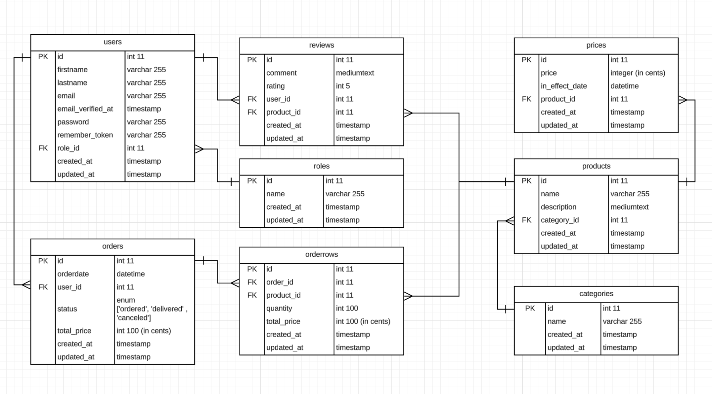

# Hoofdstuk 6 - Nieuwe entiteiten toevoegen

We breiden de spelshop stap voor stap uit met vier nieuwe entiteiten: **Price**, **Review**, **Order** en **Role**. Voor elke entiteit doorloop je telkens dezelfde stappen: model → migration → seeder → controller → route → view.  


## Inhoudsopgave
- [Hoofdstuk 6 - Nieuwe entiteiten toevoegen](#hoofdstuk-6---nieuwe-entiteiten-toevoegen)
  - [Inhoudsopgave](#inhoudsopgave)
  - [Leerdoelen](#leerdoelen)
  - [Benodigdheden](#benodigdheden)
  - [Deel 1 – Price (gezamenlijk)](#deel-1--price-gezamenlijk)
    - [Opdracht 1: Price model maken](#opdracht-1-price-model-maken)
    - [Opdracht 2: Price migration invullen](#opdracht-2-price-migration-invullen)
    - [Opdracht 3: Price seeder maken](#opdracht-3-price-seeder-maken)
    - [Opdracht 4: PriceController maken](#opdracht-4-pricecontroller-maken)
    - [Opdracht 5: Route toevoegen](#opdracht-5-route-toevoegen)
    - [Opdracht 6: View maken](#opdracht-6-view-maken)
  - [Deel 2 – Review (zelfstandig)](#deel-2--review-zelfstandig)
    - [Opdracht 7: Review – alle stappen](#opdracht-7-review--alle-stappen)
  - [Deel 3 – Order (zelfstandig)](#deel-3--order-zelfstandig)
    - [Opdracht 8: Order – alle stappen](#opdracht-8-order--alle-stappen)
  - [Deel 4 – Role (zelfstandig)](#deel-4--role-zelfstandig)
    - [Opdracht 9: Role – alle stappen](#opdracht-9-role--alle-stappen)
  - [Afronding / Reflectie](#afronding--reflectie)

## Leerdoelen
- Telkens dezelfde reeks stappen (model, migration, seeder, controller, route, view) toepassen voor een nieuwe entiteit.
- Relaties tussen modellen definiëren met `belongsTo()` en `hasMany()`.
- Eager loading gebruiken om N+1-queries te voorkomen.
- Zelfstandig een volledige entiteit opbouwen aan de hand van het ERD.

## Benodigdheden
- Werkend spelshop-project uit Hoofdstuk 1 t/m 5.
- Categories en Products zijn al aanwezig met model, migration, seeder, controller, routes en views.
- Database connectie actief; `php artisan migrate:fresh --seed` mag vrij gebruikt worden.

---

## Deel 1 – Price (gezamenlijk)

Een product kan meerdere prijzen hebben (bijhouden van prijsgeschiedenis). We bouwen Price stap voor stap op.

---

#### Opdracht 1: Price model maken

1. Genereer het model:
   ```bash
   php artisan make:model Price -m
   ```
   De vlag `-m` maakt meteen een lege migration aan.

2. Open `app/Models/Price.php` en voeg de volgende code toe aan de class:
   ```php
   protected $fillable = ['price', 'in_effect_date', 'product_id'];

   public function product()
   {
       return $this->belongsTo(Product::class);
   }
   ```

   > **Uitleg:**
   > - `$fillable` beschermt tegen mass assignment: alleen de genoemde velden mogen via `create()` of `fill()` ingevuld worden.
   > - `belongsTo(Product::class)` geeft aan dat een prijs bij één product hoort.

3. Open `app/Models/Product.php` en voeg de omgekeerde relatie toe:
   ```php
   public function prices()
   {
       return $this->hasMany(Price::class);
   }
   ```

   > Een product kan meerdere prijzen hebben, vandaar `hasMany()`.

---

#### Opdracht 2: Price migration invullen

1. Open de nieuw aangemaakte migration in `database/migrations/` (de naam eindigt op `_create_prices_table.php`).
2. Vul de `up`-methode als volgt in:
   ```php
   public function up(): void
   {
       Schema::create('prices', function (Blueprint $table) {
           $table->id();
           $table->integer('price'); // opgeslagen in centen, bijv. 3495 = €34,95
           $table->datetime('in_effect_date');
           $table->foreignId('product_id')->constrained()->cascadeOnDelete();
           $table->timestamps();
       });
   }
   ```

   > **Uitleg:**
   > - Prijzen slaan we op als geheel getal in centen. Zo vermijden we afrondingsfouten met decimalen.
   > - `foreignId('product_id')->constrained()` maakt de foreign key én koppelt die automatisch aan de `products`-tabel.
   > - `cascadeOnDelete()` zorgt dat als een product verwijderd wordt, de bijbehorende prijzen ook verwijderd worden.

3. Draai de migration:
   ```bash
   php artisan migrate
   ```

---

#### Opdracht 3: Price seeder maken

1. Maak een seeder aan:
   ```bash
   php artisan make:seeder PricesSeeder
   ```

2. Open `database/seeders/PricesSeeder.php` en voeg de volgende inhoud toe:
   ```php
   <?php
   namespace Database\Seeders;

   use App\Models\Price;
   use App\Models\Product;
   use Illuminate\Database\Seeder;

   class PricesSeeder extends Seeder
   {
       public function run(): void
       {
           $catan = Product::where('name', 'Catan')->first();
           $carcassonne = Product::where('name', 'Carcassone')->first();
           $uno = Product::where('name', 'Uno')->first();

           Price::insert([
               [
                   'price' => 3495,
                   'in_effect_date' => '2024-01-01 00:00:00',
                   'product_id' => $catan?->id,
                   'created_at' => now(),
                   'updated_at' => now(),
               ],
               [
                   'price' => 3295,
                   'in_effect_date' => '2025-01-01 00:00:00',
                   'product_id' => $catan?->id,
                   'created_at' => now(),
                   'updated_at' => now(),
               ],
               [
                   'price' => 2995,
                   'in_effect_date' => '2024-01-01 00:00:00',
                   'product_id' => $carcassonne?->id,
                   'created_at' => now(),
                   'updated_at' => now(),
               ],
               [
                   'price' => 895,
                   'in_effect_date' => '2024-01-01 00:00:00',
                   'product_id' => $uno?->id,
                   'created_at' => now(),
                   'updated_at' => now(),
               ],
           ]);
       }
   }
   ```

   > **Let op:** we zoeken producten op via hun naam (zoals in `ProductsSeeder`). Zo hoeven we geen vaste id's te hardcoderen.

3. Voeg de seeder toe in `database/seeders/DatabaseSeeder.php` **na** `ProductsSeeder`:
   ```php
   $this->call([
       CategoriesSeeder::class,
       ProductsSeeder::class,
       PricesSeeder::class, // nieuw
   ]);
   ```

4. Draai de migrations en seeders opnieuw:
   ```bash
   php artisan migrate:fresh --seed
   ```

---

#### Opdracht 4: PriceController maken

1. Maak de controller aan:
   ```bash
   php artisan make:controller PriceController
   ```

2. Open `app/Http/Controllers/PriceController.php` en voeg een `index`-methode toe:
   ```php
   <?php

   namespace App\Http\Controllers;

   use App\Models\Price;

   class PriceController extends Controller
   {
       public function index()
       {
           $prices = Price::with('product')->orderBy('in_effect_date', 'desc')->get();

           return view('prices.index', compact('prices'));
       }
   }
   ```

   > **Uitleg:**
   > - `Price::with('product')` laadt het gekoppelde product in één query mee (eager loading). Zonder dit zou Laravel voor iedere prijs apart een query uitvoeren om het product op te halen.
   > - `orderBy('in_effect_date', 'desc')` toont de meest recente prijzen bovenaan.

---

#### Opdracht 5: Route toevoegen

1. Open `routes/web.php`.
2. Voeg de route toe:
   ```php
   Route::get('/prices', [PriceController::class, 'index']);
   ```
3. Voeg bovenaan de import toe:
   ```php
   use App\Http\Controllers\PriceController;
   ```

4. Voeg optioneel een link toe aan de navigatie in `resources/views/components/layout.blade.php`:
   ```html
   <a href="/prices">Prijzen</a>
   ```

---

#### Opdracht 6: View maken

1. Maak de map `resources/views/prices/` aan (of draai het commando `php artisan make:view prices.index`).
2. Maak daarin het bestand `index.blade.php` met de volgende inhoud:
   ```blade
   <x-layout title="Prijzen">
       <h1>Prijsoverzicht</h1>

       @if($prices->isEmpty())
           <p>Er zijn nog geen prijzen ingevoerd.</p>
       @else
           <table border="1" cellpadding="8">
               <thead>
                   <tr>
                       <th>Product</th>
                       <th>Prijs</th>
                       <th>Geldig vanaf</th>
                   </tr>
               </thead>
               <tbody>
                   @foreach($prices as $price)
                       <tr>
                           <td>{{ $price->product->name ?? 'Onbekend' }}</td>
                           <td>€ {{ number_format($price->price / 100, 2, ',', '.') }}</td>
                           <td>{{ \Carbon\Carbon::parse($price->in_effect_date)->format('d-m-Y') }}</td>
                       </tr>
                   @endforeach
               </tbody>
           </table>
       @endif
   </x-layout>
   ```

   > **Uitleg:**
   > - `$price->product->name` werkt omdat we in de controller `with('product')` hebben gebruikt.
   > - `number_format($price->price / 100, 2, ',', '.')` zet centen om naar een leesbare prijs (bijv. 3495 → 34,95).
   > - `Carbon::parse(...)->format('d-m-Y')` maakt van de datetime een nette datum.

3. Test de pagina in de browser: `https://spelshop.test/prices`

   Controleer:
   - Zijn alle vier de prijsregels zichtbaar?
   - Worden productnamen correct getoond?
   - Klopt de prijsopmaak (€ 34,95)?

---

## Deel 2 – Review (zelfstandig)

Je doorloopt nu dezelfde stappen zelfstandig voor **Review**. Gebruik Deel 1 als voorbeeld.

---

#### Opdracht 7: Review – alle stappen

Gegevens volgens het ERD:
| Veld | Type | Opmerking |
|---|---|---|
| `comment` | `mediumText` | De tekst van de review |
| `rating` | `integer` | Cijfer van 1 t/m 5 |
| `user_id` | foreign key | Welke gebruiker heeft de review geschreven |
| `product_id` | foreign key | Op welk product slaat de review |

**Stap 1 – Model**
- Commando: `php artisan make:model Review -m`
- Voeg `$fillable` toe met alle vier velden.
- Voeg twee relaties toe: `product()` (belongsTo) en `user()` (belongsTo).
- Voeg ook de omgekeerde relatie `reviews()` toe aan `Product` (hasMany).

**Stap 2 – Migration**
- Gebruik `mediumText` voor `comment`.
- Gebruik `integer` voor `rating`.
- Voeg twee foreign keys toe: `product_id` en `user_id`. Beide verwijzen naar de bijbehorende tabellen met `constrained()`.

**Stap 3 – Seeder**
- Commando: `php artisan make:seeder ReviewsSeeder`
- Zoek producten op via naam (net als in `PricesSeeder`).
- Zoek een user op via `User::first()` of maak in `DatabaseSeeder` eerst een testgebruiker aan.
- Voeg minimaal 3 reviews in.
- Vergeet niet de seeder toe te voegen aan `DatabaseSeeder`.
- Draai: `php artisan migrate:fresh --seed`

**Stap 4 – Controller**
- Commando: `php artisan make:controller ReviewController`
- Maak een `index`-methode die alle reviews ophaalt met eager loading van `product` en `user`.
- Sorteer op `created_at` aflopend.

**Stap 5 – Route**
- Voeg een route toe voor `GET /reviews`.

**Stap 6 – View**
- Maak `resources/views/reviews/index.blade.php`.
- Toon een tabel met: productnaam, gebruikersnaam, rating (1-5) en comment.
- Gebruik `<x-layout>` als omhulsel.

**Controleer:**
- [ ] `php artisan migrate:fresh --seed` geeft geen fouten.
- [ ] `/reviews` toont een overzicht van reviews met product- en gebruikersnaam.
- [ ] De relaties `Review->product` en `Review->user` werken.

---

## Deel 3 – Order (zelfstandig)

Orders zijn iets complexer: een order bevat meerdere producten via een tussentabel (`orderrows`). Die tussentabel heeft **geen eigen model** — je maakt alleen een migration.

---

#### Opdracht 8: Order – alle stappen

Gegevens voor de `orders`-tabel:
| Veld | Type | Opmerking |
|---|---|---|
| `orderdate` | `datetime` | Datum en tijdstip van bestelling |
| `status` | `enum` | Toegestane waarden: `ordered`, `delivered`, `canceled` |
| `total_price` | `integer` | Totaalprijs in centen |
| `user_id` | foreign key | Welke gebruiker heeft besteld |

Gegevens voor de `orderrows`-tabel (tussentabel, geen model):
| Veld | Type | Opmerking |
|---|---|---|
| `order_id` | foreign key | Koppeling naar de order |
| `product_id` | foreign key | Welk product in de bestelling |
| `quantity` | `integer` | Aantal stuks |
| `total_price` | `integer` | Regelprijs in centen |

**Stap 1 – Model**
- Commando: `php artisan make:model Order -m`
- Voeg `$fillable` toe.
- Voeg relaties toe: `user()` (belongsTo) en `orderrows()` (hasMany naar een Orderrow model — zie tip hieronder).
- Voeg de omgekeerde relatie `orders()` toe aan `User` (hasMany).

> **Tip Orderrow:** er is geen `Orderrow`-model, maar Laravel verwacht standaard een model wanneer je `hasMany(Orderrow::class)` schrijft. Maak daarom ook een Orderrow-model aan:
> ```bash
> php artisan make:model Orderrow
> ```
> Voeg aan `Orderrow` de relaties `order()` (belongsTo) en `product()` (belongsTo) toe.

**Stap 2 – Migrations**
- De `-m` vlag heeft al een migration voor `orders` aangemaakt. Vul die in.
- Voor de tussentabel maak je een **aparte** migration aan:
  ```bash
  php artisan make:migration create_orderrows_table
  ```
  Vul ook deze migration in met de vier velden uit de tabel hierboven. Gebruik `cascadeOnDelete()` op beide foreign keys.
- Gebruik voor het `status`-veld een enum:
  ```php
  $table->enum('status', ['ordered', 'delivered', 'canceled'])->default('ordered');
  ```

**Stap 3 – Seeder**
- Commando: `php artisan make:seeder OrdersSeeder`
- Maak minimaal 2 orders aan voor een bestaande gebruiker.
- Je hoeft geen orderrows te seeden (dat is optioneel).
- Voeg de seeder toe aan `DatabaseSeeder` en draai opnieuw: `php artisan migrate:fresh --seed`

**Stap 4 – Controller**
- Commando: `php artisan make:controller OrderController`
- Maak een `index`-methode die alle orders ophaalt met eager loading van `user`.
- Sorteer op `orderdate` aflopend.

**Stap 5 – Route**
- Voeg een route toe voor `GET /orders`.

**Stap 6 – View**
- Maak `resources/views/orders/index.blade.php`.
- Toon een tabel met: gebruikersnaam, besteldatum, status en totaalprijs (in euro's).
- Gebruik `<x-layout>` als omhulsel.

**Controleer:**
- [ ] `php artisan migrate:fresh --seed` geeft geen fouten.
- [ ] Zowel de `orders` als de `orderrows` tabel bestaat in de database.
- [ ] `/orders` toont een overzicht van bestellingen.

---

## Deel 4 – Role (zelfstandig)

Roles zijn eenvoudig: een rol heeft alleen een naam. De koppeling naar users verloopt via een foreign key `role_id` in de `users`-tabel.

---

#### Opdracht 9: Role – alle stappen

Gegevens voor de `roles`-tabel:
| Veld | Type | Opmerking |
|---|---|---|
| `name` | `string` | Naam van de rol, bijv. `admin`, `klant` |

**Stap 1 – Model**
- Commando: `php artisan make:model Role -m`
- Voeg `$fillable` toe met `name`.
- Voeg de relatie `users()` toe (hasMany naar User).
- Voeg de omgekeerde relatie `role()` toe aan `User` (belongsTo Role).

**Stap 2 – Migrations**
- Vul de migration voor `roles` in met alleen het veld `name`.
- Voeg daarna in een **aparte** migration `role_id` toe aan de `users`-tabel:
  ```bash
  php artisan make:migration add_role_id_to_users_table
  ```
  Vul die migration als volgt in:
  ```php
  public function up(): void
  {
      Schema::table('users', function (Blueprint $table) {
          $table->foreignId('role_id')->nullable()->constrained()->nullOnDelete();
      });
  }

  public function down(): void
  {
      Schema::table('users', function (Blueprint $table) {
          $table->dropForeign(['role_id']);
          $table->dropColumn('role_id');
      });
  }
  ```

  > **Let op:** de `roles`-migration moet **eerder uitgevoerd worden** dan de `users`-migration die `role_id` toevoegt. Laravel voert migrations uit op bestandsnaam (datum-prefix). Controleer of de nummering klopt.

**Stap 3 – Seeder**
- Commando: `php artisan make:seeder RolesSeeder`
- Voeg minimaal de rollen `admin`, `medewerker` en `klant` in.
- Voeg de seeder toe aan `DatabaseSeeder` **vóór** de `UsersSeeder` (of als er nog geen UsersSeeder is, gewoon als eerste).
- Draai: `php artisan migrate:fresh --seed`

**Stap 4 – Controller**
- Commando: `php artisan make:controller RoleController`
- Maak een `index`-methode die alle rollen ophaalt.

**Stap 5 – Route**
- Voeg een route toe voor `GET /roles`.

**Stap 6 – View**
- Maak `resources/views/roles/index.blade.php`.
- Toon een eenvoudige lijst van alle rolnamen.
- Gebruik `<x-layout>` als omhulsel.

**Controleer:**
- [ ] `php artisan migrate:fresh --seed` geeft geen fouten.
- [ ] De kolom `role_id` bestaat in de `users`-tabel.
- [ ] `/roles` toont de drie rollen.

---

## Afronding / Reflectie

Je hebt voor vier entiteiten telkens dezelfde stappen doorlopen:

| Stap | Wat doe je? |
|---|---|
| Model | Maak het model, stel `$fillable` in en definieer relaties |
| Migration | Beschrijf de tabelstructuur met de juiste veldtypes en foreign keys |
| Seeder | Voeg testdata in die de relaties correct respecteert |
| Controller | Haal data op (met eager loading) en geef die door aan de view |
| Route | Koppel een URL aan de controllermethode |
| View | Toon de data overzichtelijk in een Blade-template |

**Volgende stap:** in Hoofdstuk 7 voeg je CRUD-functionaliteit toe (create, update, delete) en werk je met formulieren en validatie.

